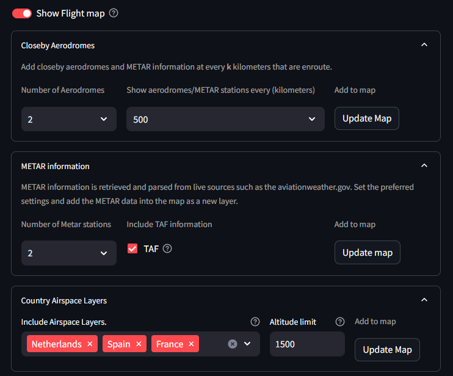
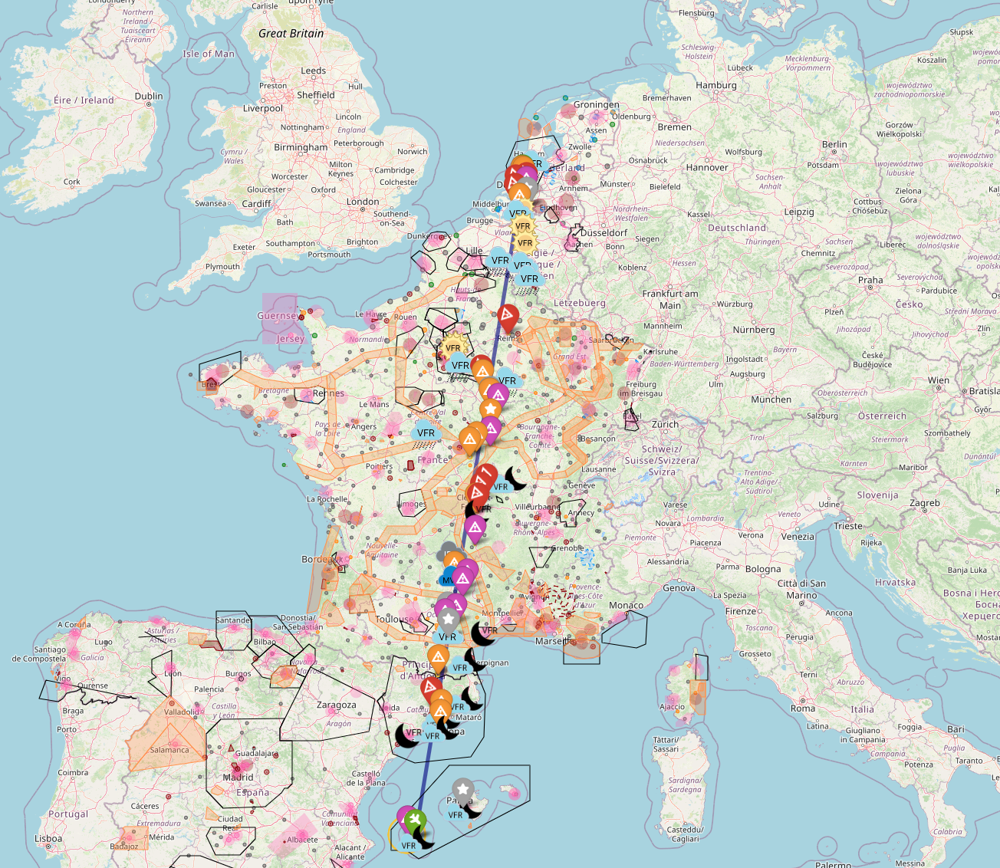

Flightmap Introduction
***********************

The **FlightMap** tab contains information from various tabs and projects it onto the interactive flight map.
The map will show the departure, arrival, and alternate aerodromes with static, real-time, and user-defined information and images.

**A summary of information that can be seen on the map:**

    * The route between Departure-Arrival: a direct line for illustration and not navigation.
    * Nearby Aerodromes: Various colors are used to separate between Public, Military, and Private aerodromes, as well as between Grass and Asphalt runways.
    * METAR information: Real-time information from the closest weather stations is processed and projected.
    * NOTAM information: Active NOTAMs are processed and projected.
    * Airspaces and other areas: Gliding, parachute zones, etc.

.. warning::
    There is no guarantee that the data in the map is correct. Always check it against your own trusted source.

Settings of the Flightmap
****************************

There are various settings that can be set to filter information in such a manner that only relevant information is shown for your flight plan.

.. table:: Settings of the Flight Map
   :align: center

   +----------+
   |  |figF1| |
   +----------+

Data Source
---------------------------

The data source of the **airspaces** and **NOTAMs** is from: https://nats-uk.ead-it.com/cms-nats/opencms/en/NOTAM/

Closeby Aerodromes
-------------------

The aerodromes closest to the departure, arrival, and the path in between can be projected onto the map.
You can do this by selecting the number of aerodromes and specifying the interval in kilometers.
The default is set to 100 km, meaning that every 100 km between the departure and arrival, projections of nearby aerodromes, METAR stations, and NOTAMs are added to the map.

This option is helpful when flying longer distances. In the example below, the departure is set from **EHRD** in the Netherlands and the arrival is **LEIB** in Spain.
It can be seen that every 500 km, information is projected along with METAR and NOTAM information. If you set it to 1000 km, the interval of information would be larger.

.. table:: Projection of information into the map for **EHRD** to **LEIB**.
   :align: center

   +----------+
   |  |figF2| |
   +----------+

Set METAR Information
----------------------

The number of weather stations can be set and also whether TAF information is desired. Press ``Update Map`` to update the map with the new information.
More information about the METAR is described in the ``Departure/ Arrival`` section.

NOTAM Information
-------------------

NOTAM (Notice to Airmen) is another critical communication tool used in aviation to alert pilots and other personnel to potential hazards or important information affecting flight operations.
These notices provide real-time updates about temporary changes or conditions at airports and along flight routes such as:

    * Runway closures
    * Airspace restrictions
    * Equipment outages

The number of NOTAMs can vary from tens to hundreds/ thousand notices for large countries.
To prevent overkill of information, SkyWalk filters notices on your flight details and are then projecten on the Flight Map.

**Notices are in SkyWalk are presented by:**

    * Flight Altitude: Only show notices in your the relevant Altitude.
    * Date of flight: Only show the active notices.
    * Only notices within 50km radius between the departure and arrival and the flying route.
    * Notices are combined when multiple notices are present within a radius of 5km of each other.

Country Airspace Layers
---------------------------

The underneath countries in the table have NOTAM information and are updated periodically.
The use of Altitude limit filters out NOTAms and airspaces that are not in the flying altitude. If this value is set to **0**, all NOTAMs and airspaces are shown.
Press ``Update Map`` to update the map with the new information.

+------------------+------------------+------------------+
| Country          | Number of NOTAMs | Valid Date       |
+==================+==================+==================+
| Austria          |       77         |  Auto update     |
+------------------+------------------+------------------+
| Belgium          |      252         |  Auto update     |
+------------------+------------------+------------------+
| Canary           |    787           |  Auto update     |
+------------------+------------------+------------------+
| Denmark          |     162          |  Auto update     |
+------------------+------------------+------------------+
| France           |    1812          |  Auto update     |
+------------------+------------------+------------------+
| Germany          |      1079        |  Auto update     |
+------------------+------------------+------------------+
| Iceland          |      37          |  Auto update     |
+------------------+------------------+------------------+
| Ireland          |      101         |  Auto update     |
+------------------+------------------+------------------+
| Italy            |      978         |  Auto update     |
+------------------+------------------+------------------+
| Netherlands      |     256          |  Auto update     |
+------------------+------------------+------------------+
| North Sea        |       787        |  Auto update     |
+------------------+------------------+------------------+
| Norway           |        210       |  Auto update     |
+------------------+------------------+------------------+
| Portugal         |    186           |  Auto update     |
+------------------+------------------+------------------+
| Spain            |    1061          |  Auto update     |
+------------------+------------------+------------------+
| Sweden           |    177           |  Auto update     |
+------------------+------------------+------------------+
| Switzerland      |     140          |  Auto update     |
+------------------+------------------+------------------+
| UK Channel       |      787         |  Auto update     |
+------------------+------------------+------------------+
| United Kingdom   |       787        |  Auto update     |
+------------------+------------------+------------------+

.. warning::
    There is no guarantee that the data in the map is correct. Always check it against your own trusted source.

The Flight Map
**************************

The flight map is created using the information across the various tabs and filtered on custom user settings.

.. |figF3| image:: ../figs/flightmap_example.gif

.. table:: Flight Map Demo.
   :align: center

   +----------+
   |  |figF3| |
   +----------+

.. include:: add_bottom.add