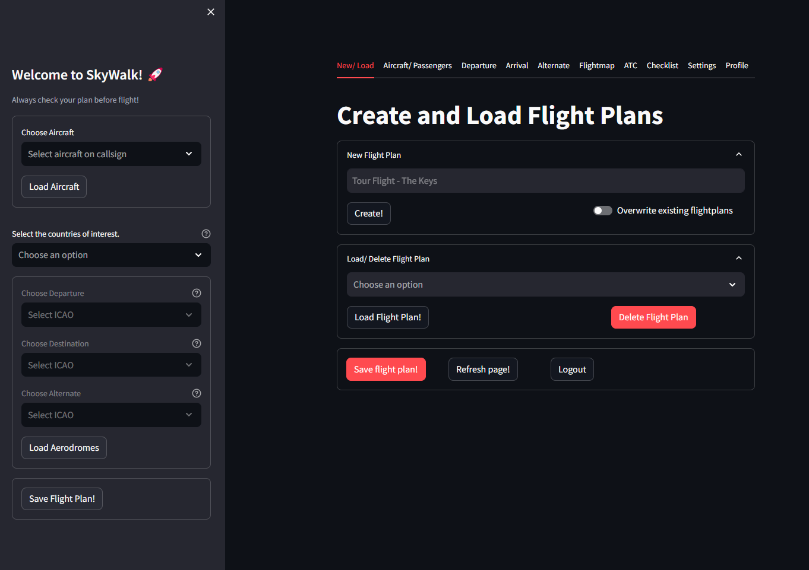
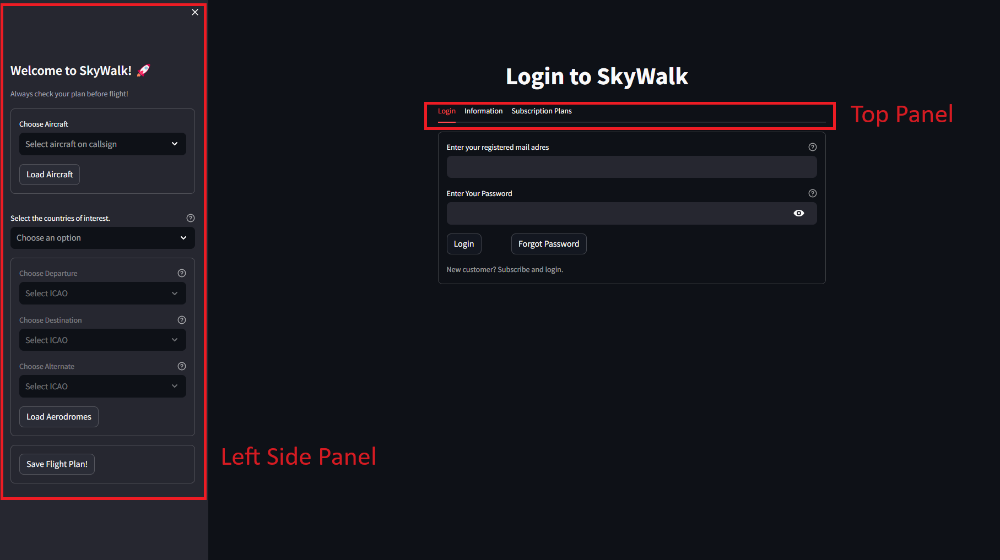

Introduction to Flight Preparation
*************************************

Flight preparation is a complex process that requires many steps of planning and organizing essential details before a flight.
It encompasses tasks such as assessing weather conditions, determining aircraft performance capabilities, calculating fuel requirements, and ensuring compliance with regulatory guidelines.
Effective flight preparation is crucial for enhancing safety, efficiency, and adherence to flight schedules.
It involves the integration of various sources of information and attention to detail to mitigate risks and ensure a smooth and successful flight experience.

Flight preparation details are organized over various tabs in SkyWalk.
Each tab contains multiple expanders where information is either automatically loaded from static or live sources or requires user input.
After the login screen, the tabs can be found at the top of the screen as shown in the screenshot.
To start using SkyWalk, you need to log in first. The subscription plans can be found in the Subscription tab.

**A summary of the tabs is as follows:**

* **New/Load:** Create new flight plans or load previously saved ones.
* **Aircraft/Passengers:** Specify the aircraft type and passengers with their weight distribution. Details about flight time, weight and balance schemes, logbook, and costs are computed in this section.
* **Departure/Arrival/Alternate:** Three tabs with the details about the departure, arrival, and alternate aerodromes. Information is shown about runway length, elevation levels, and weather conditions such as METAR. The static information is combined with live information and your specific input. Details about crosswind, required runway length, wind envelope, and cloud base are computed and visually presented.
* **Flightmap:** The flight map is a visual map where information is projected from the different sections. The aerodromes are shown with their information. A direct line is drawn between the departure, arrival, and alternate aerodromes. Airspaces are included, and live weather conditions from METARs and NOTAMs can be loaded with one click of a button. All information is filtered for your flight plan, including your flight altitude.
* **ATC:** Transcripts are automatically created based on the information that is provided in various other sections in SkyWalk.
* **Checklist:** Load or customize a checklist for the tasks that need to be done.
* **Settings:** Technical information from the POH must be listed here. Checklists can be adjusted or newly created. Aerodrome defaults can be set.
* **Profile:** User information like passwords and subscriptions can be changed here.

.. table:: 
   :align: center

   +----------+
   | |fig2A|  |
   +----------+

Login Screen
********************

The login screen contains three panels. The main panel includes a few tabs at the top where general information about SkyWalk is described along with the subscription plans.
The left-side panel lists all countries and aerodromes, giving you an indication of whether your aerodrome of interest is available.
If your aerodrome is not available, send an email to skywalk.noreply@gmail.com to discuss the options.

.. table:: 
   :align: center

   +----------+
   | |fig2B|  |
   +----------+

Expander Sections
********************
Each tab contains multiple expanders where information is organized into specific categories.
Every expander starts with either an exclamation mark or a green check mark.
This shows whether all necessary information in the specific expander is complete.
If information is required and missing, a message will indicate which part of the information is missing.
There is a lot of logic incorporated to help you fill in all the details.

.. note::
    * ❗Exclamation mark indicates an important note or warning.
    * ✅ Green check indicates that all required fields are successfully processed.

.. warning::
    The green check ✅ only depicts whether information is provided. It does not describe the quality nor correctness of the input.

.. include:: add_bottom.add