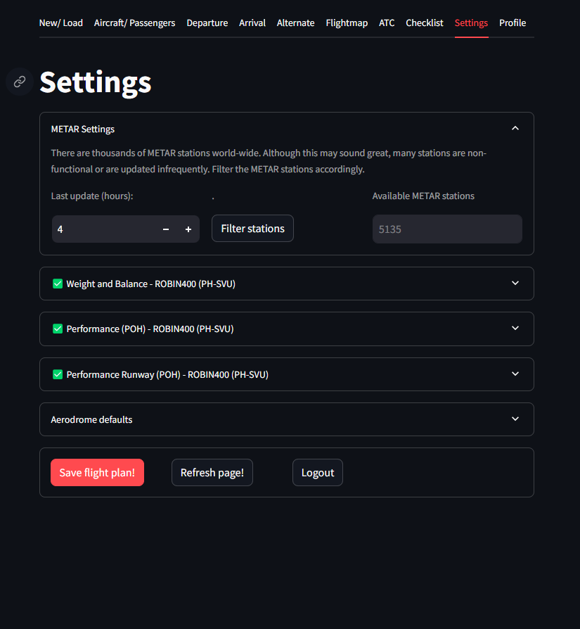
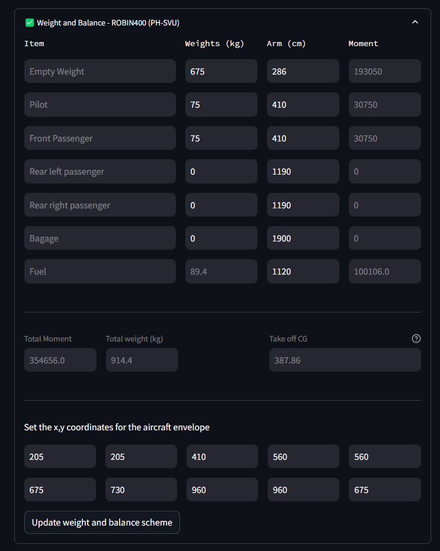
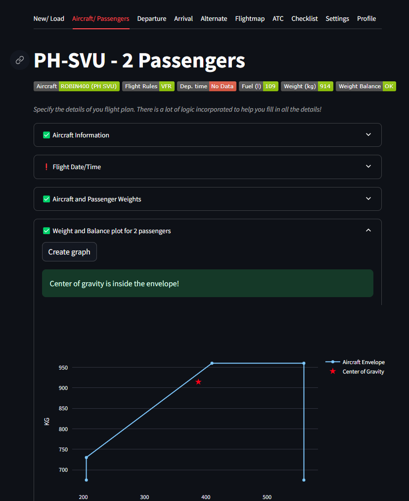
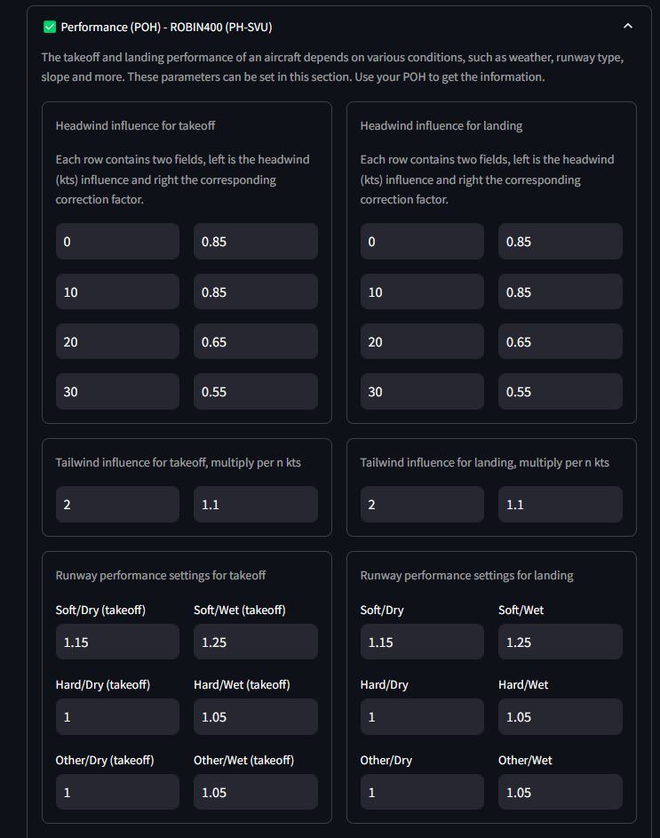
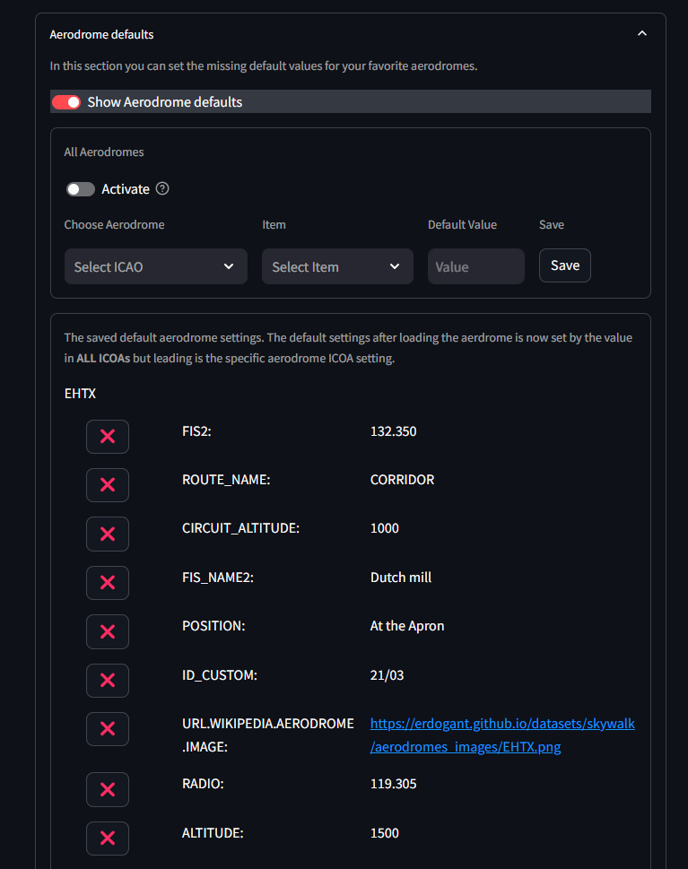

METAR Settings
********************

The tab settings contains multiple expanders with various topics.
In the METAR settings the stations are filtered on their activity. METAR stations are removed that did not return any information in the last 4 hours.
The activity in hours can be changed.

.. table:: Filter METAR stations on activity.
   :align: center

   +----------+
   |  |figS2| |
   +----------+

Weight and Balance
************************

The correct weight and balance of an aircraft is critical for safe and efficient flight operations.
Weight and balance calculations are necessary to determine the aircraft’s center of gravity (CG) and ensure it remains within permissible limits throughout the flight.
The center of gravity affects the stability and controllability of the aircraft and therefore key to prevent handling difficulties and potentially unsafe flight conditions.

**The parameters involved in weight and balance calculations include:**

    * 1. **Weight of Components:** Each item loaded on the aircraft, such as the empty weight of the aircraft, pilot, passengers, baggage, and fuel, has a specific weight (measured in kilograms in this example).
    * 2. **Arm:** The arm is the distance from a reference datum to the center of gravity of each weight component. It is usually measured in centimeters.
    * 3. **Moment:** The moment is the product of the weight of each component and its arm. It represents the rotational force applied by the weight around the reference point.

In the example below is shown the weight and balance calculation for a ROBIN400 aircraft.
The table lists different items (e.g., empty weight, pilot, passengers, baggage, fuel) along with their corresponding weights, arms, and moments.
The total moment and total weight are calculated to determine the aircraft’s takeoff CG.

Additionally, there is also the part for setting the x, y coordinates for the aircraft envelope, which helps visualize whether the aircraft’s CG is within safe limits on a graph.
The graphical envelope further aids in confirming that the CG remains within acceptable limits throughout the flight.

.. table:: Weight and Balance and envelope.
   :align: center

   +----------+----------+
   |  |figS3| |  |figS4| |
   +----------+----------+

    

Performance (POH)
************************

The Performance Operating Handbook (POH) provides detailed performance settings with flight parameters based on various conditions such as weather, runway type, and runway slope.
These performance settings are essential for calculating accurate takeoff and landing distances, fuel consumption, and overall aircraft handling characteristics.

In ``SkyWalk``, a comprehensive setup to list your aircraft's performance settings.

.. table:: POH Settings.
   :align: center

   +----------+
   |  |figS5| |
   +----------+

**Headwind Influence for Takeoff and Landing:**

- **Takeoff:** Headwind components improve takeoff performance by reducing the required ground roll distance. The correction factors for different headwind speeds (e.g., 0, 10, 20, 30 knots) are shown, with stronger headwinds reducing the takeoff distance.
- **Landing:** Similarly, headwind components assist in shorter landing rolls, with corresponding correction factors provided for varying headwind speeds.

*Tailwind Influence for Takeoff and Landing:*

- **Takeoff and Landing:** Tailwinds generally have an adverse effect, increasing the required distances for both takeoff and landing. The figure shows the multiplication factors for different tailwind speeds, indicating how much more distance is needed per knot of tailwind.

**Runway Performance Settings**

*Runway Conditions:*

- **Takeoff:** The correction factors for different runway conditions (Soft/Dry, Soft/Wet, Hard/Dry, Hard/Wet, Other/Dry, Other/Wet) are displayed. These factors adjust the performance calculations based on the surface and condition of the runway, which significantly affect the aircraft's acceleration and deceleration.
- **Landing:** Similar correction factors are shown for landing under various runway conditions, ensuring accurate performance assessment and safety margins.

**Practical Use**

These performance settings are vital to ensure safe and efficient aircraft operation.
By applying the appropriate correction factors from the POH, SkyWalk can compute the takeoff and landing distances where it will account for real-time weather conditions and runway characteristics.

Aerodrome Defaults
************************

Many of the custom user changes are stored in a database for later usage.
To control the custom user stored information, this section will help to delete information.

.. table:: POH Settings.
   :align: center

   +----------+
   |  |figS6| |
   +----------+

.. include:: add_bottom.add